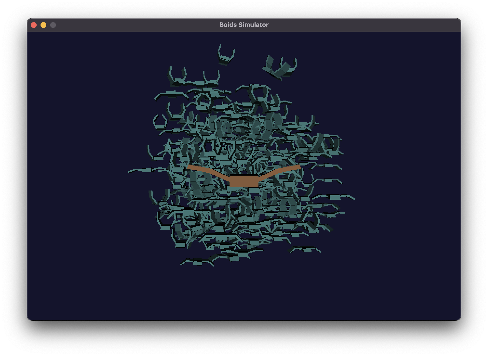

# Boids Simulation - Cursor Recreation

This repository contains a recreation of my original boids (bird flocking) simulation senior project, rebuilt using Cursor AI. The project demonstrates emergent flocking behavior through the implementation of Craig Reynolds' boids algorithm.



**[🎥 Watch Demo Video](https://www.youtube.com/watch?v=bUsnMwt1Q2g)**

*The demo shows the simulation in action with 300 3D boids exhibiting realistic flocking behavior, wing animations, and interactive predator/attractor controls.*

## Project Overview

The boids simulation showcases how complex flocking behavior can emerge from simple rules:
- **Cohesion**: Boids move toward the center of nearby flock members
- **Separation**: Boids avoid collisions by steering away from nearby boids
- **Alignment**: Boids match velocity with nearby flock members

## Features

- **300 3D Boids**: Each boid is rendered as a detailed 3D model with wings, body, head, and tail
- **Realistic Wing Animation**: Wings flap with non-uniform movement patterns
- **Flocking Behavior**: Boids follow the classic flocking rules with configurable parameters
- **Predator/Attractor**: A special boid that can attract or repel the flock
- **3D Lighting**: Dynamic lighting with material properties
- **Boundary Handling**: Boids are kept within a 3D box boundary
- **Interactive Controls**: Full keyboard controls for real-time interaction

## Quick Start

### Prerequisites
- macOS with Homebrew
- SDL2: `brew install sdl2`
- OpenGL (built into macOS)

### Building and Running
```bash
# Compile the simulation
make

# Run the simulation
./boids_opengl
```

### Controls
- **WASD/ZX**: Move predator/attractor
- **U**: Toggle predator behavior (attractor/neutral/repeller)
- **I**: Toggle flock scattering (inverts cohesion behavior)
- **O/P**: Resume/pause animation
- **M**: Rotate the predator model
- **L**: Toggle lighting (solid/wireframe mode)
- **Q**: Quit

## Technical Details

### Original Project
This recreates my senior project from Cal Poly SLO (2010) that demonstrated emergent behavior in computer graphics. The original used GLUT for window management, while this version uses SDL2 for better cross-platform compatibility.

### Algorithm
The simulation implements the classic Craig Reynolds boids algorithm with three main forces that create emergent flocking behavior:

1. **Flock Centering (Cohesion)**: Boids move toward the center of mass of nearby boids
2. **Collision Avoidance (Separation)**: Boids steer away from nearby boids to avoid collisions
3. **Velocity Matching (Alignment)**: Boids adjust their velocity to match nearby boids

Each boid considers its neighbors within specific radii for each behavior type.

### Rendering
- Uses OpenGL for 3D rendering
- Each boid is composed of multiple geometric primitives
- Dynamic lighting with ambient, diffuse, and specular components
- Perspective projection with depth testing
- Realistic wing flapping animations with body height variation

### Configuration
The simulation uses the same parameters as the original:
- **300 boids** (BOIDSCOUNT)
- **3D boundary box**: -250 to 250 in X/Y, 250 to 700 in Z
- **Wing animation**: 67.5° maximum wing angle
- **Velocity limits**: 10.0 maximum speed
- **Collision radius**: 10.0 units for separation

## Development

This project was recreated using Cursor AI, demonstrating how modern AI tools can help reconstruct and improve legacy code while maintaining the original vision and behavior.

## Files

- `boids_opengl.cpp` - Main OpenGL implementation
- `Makefile` - Build configuration
- `README_opengl.md` - Detailed technical documentation
- `README.md` - This file

## License

Original work by Brent Dimapilis (2010). Recreated with Cursor AI (2024). 